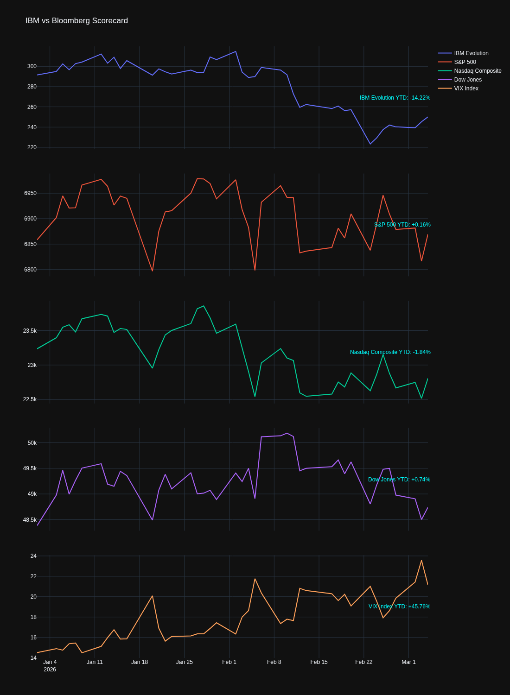

# IBM & Bloomberg Market Intelligence Dashboard

A professional-grade financial visualization suite.

## 📊 Dashboard Preview

## 💎 Pro Release
The official stable version is available under the **Releases** tab.
* **Current Version:** [v1.0.0-pro](https://github.com/LauroBeck/IBM-Market-Intelligence/releases/latest)

## 🛠️ Setup
1. Clone the repo: `git clone https://github.com/LauroBeck/IBM-Market-Intelligence.git`
2. Install dependencies: `pip install pandas yfinance plotly kaleido`
3. Run: `python Final3.py`
