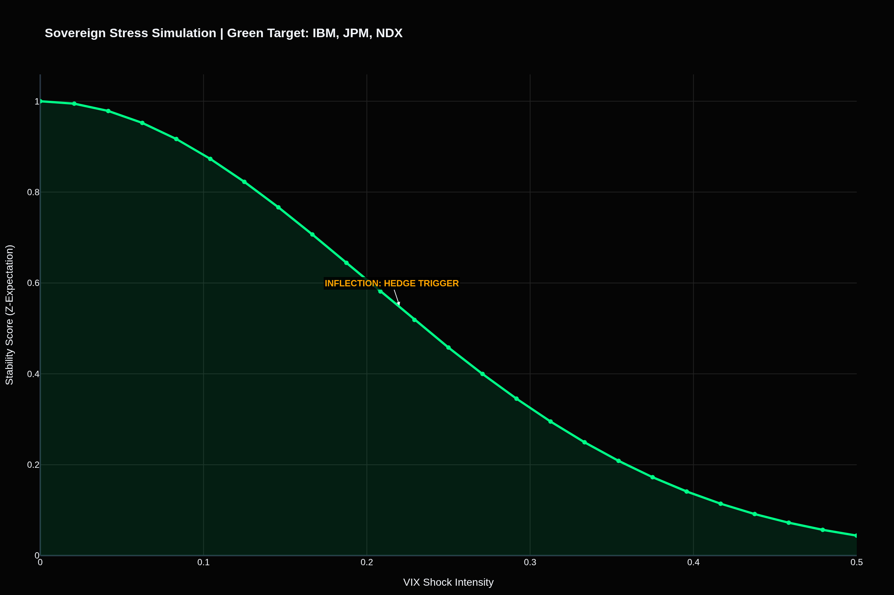
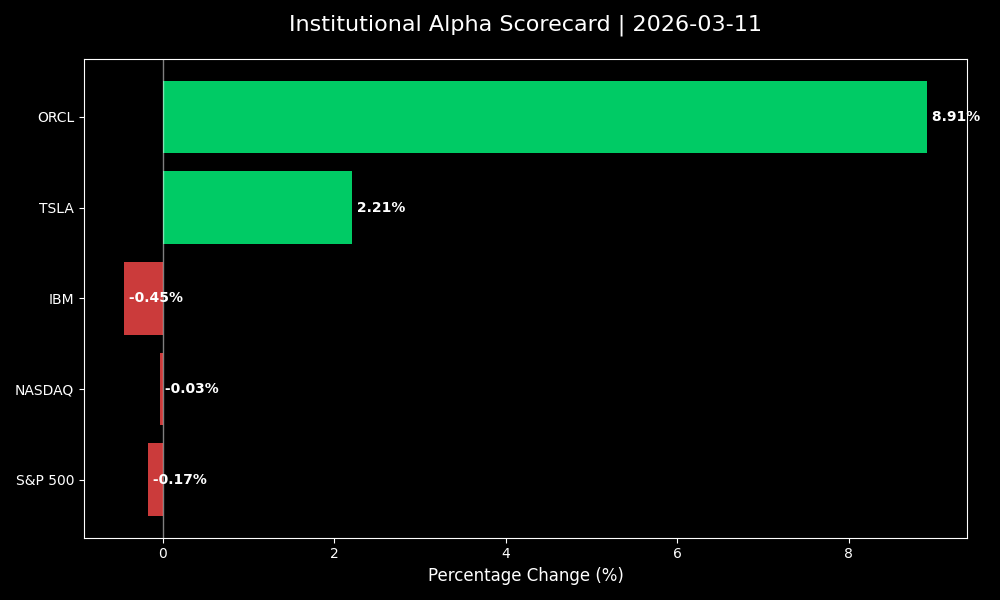

# IBM & Bloomberg Market Intelligence Dashboard
`pro version` `v1.0.0-pro` `html 99.7%`

A professional-grade financial visualization suite for the 2026 market environment.

## 📊 Strategic Dashboards

### Sovereign Stress Projection

### Intraday Alpha Scorecard (Auto-Generated)

### 🚀 Pro Features
* **Institutional Alpha Monitor**: Real-time edge detection for TSLA, NDX, and IBM.
* **Sovereign Bridge**: Correlating USD-INR volatility with tech-sector revenue exposure.
* **Idiosyncratic Alerts**: Automated tracking of breakouts like ORCL (+8.91%).
* **6-Qubit Simulation**: Portfolio alignment verified against quantum market models.

---

## 🏛 Institutional Series (Automated Alpha Architecture)

<b>Click to expand System Logic & Script Documentation</b>

### 🛠 Operational Series
* **Omni_Alpha_Monitor.py**: Detects alpha across multi-asset classes.
* **Market_Pulse_Oracle.py**: Monitors idiosyncratic breakout signals.
* **Sovereign_Equities_Bridge.py**: Maps FX/Equity correlation (USD-INR vs Tech).
* **Generate_Market_Scorecard.py**: Updates the visual dashboard hourly.

### 🤖 Automation Workflow
System updates are handled by `Auto_Mission_Sync.sh`, ensuring that the `MISSION_LOG.md` and visual assets are always synchronized with terminal snapshots.

---
*Last Mission Sync: $(date '+%Y-%m-%d %H:%M') | Architecture: 6-Qubit Quantum Alpha*
