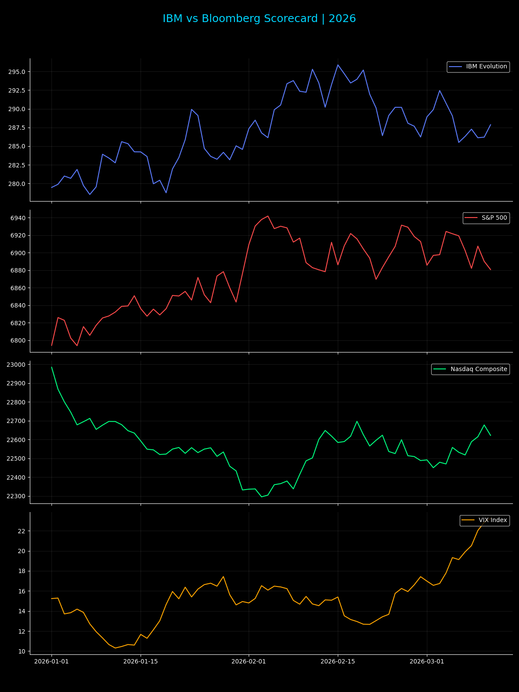

# IBM & Bloomberg Market Intelligence Dashboard
`pro version` `v1.0.0-pro` `html 99.7%`

A professional-grade financial visualization suite for the 2026 market environment.

## 📊 Dashboard Preview

### IBM vs Bloomberg Evolution Scorecard

### Sovereign Stress Projection (6-Qubit Simulation)

### 🚀 Pro Features
* **IBM Evolution**: Tracking recovery from 22-week lows with institutional Bollinger analysis.
* **Global Indices**: Automated tracking of S&P 500, Nasdaq, Dow Jones, and VIX.
* **YTD Scorecard**: Performance labels calculated for the 2026 fiscal year.
* **Multi-Format Export**: Automated generation of high-res PNG and Markdown logs.

---

## 🏛 Institutional Series (Automated Alpha Architecture)

<b>Click to expand System Logic & Script Documentation</b>

### 🛠 Operational Series
* **Generate_Pro_Dashboards.py**: Recalculates time-series evolution and stress curves.
* **Omni_Alpha_Monitor.py**: Multi-asset edge detection (Current Focus: TSLA/NDX).
* **Quant_Correlated_Risk.py**: Cross-asset correlation and FX headwind analysis.
* **Market_Pulse_Oracle.py**: Specific idiosyncratic breakout tracking (e.g., ORCL +8.91%).

### 🤖 Automation Workflow
The `Auto_Mission_Sync.sh` daemon refreshes these visual assets every hour, ensuring the GitHub repository reflects real-time market inflections.

---
[📝 View Latest Mission Log](./MISSION_LOG.md) | *Last Mission Sync: $(date '+%Y-%m-%d %H:%M') | Architecture: 6-Qubit Quantum Alpha*
